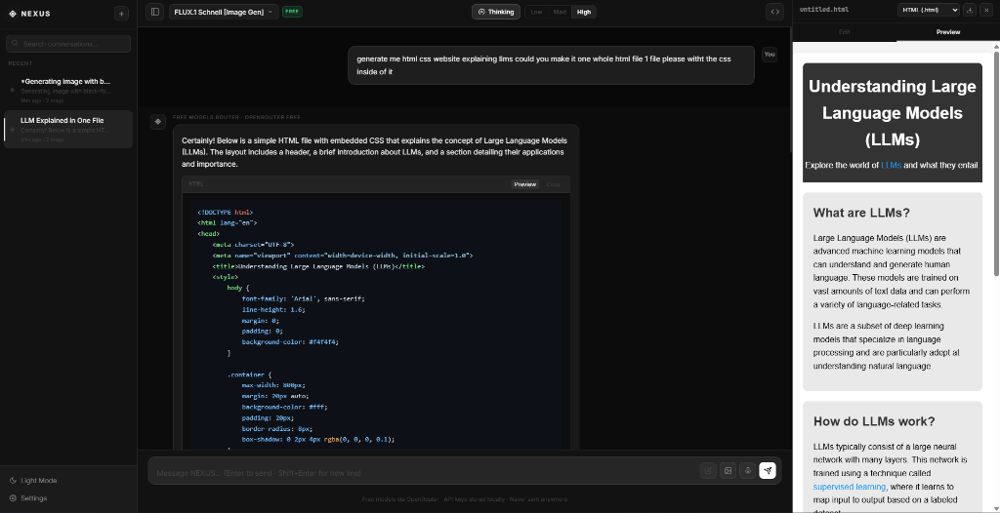
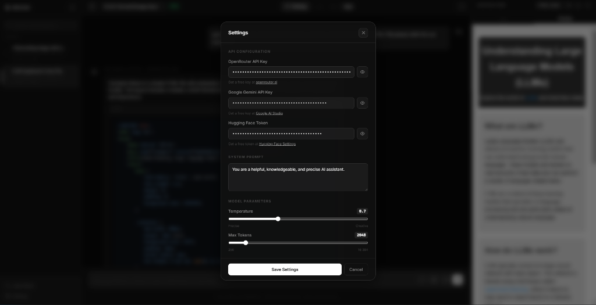

# 🌌 NEXUS

NEXUS is a premium, local-first web-based AI interface built with Vanilla HTML, CSS, and JS. It features a stunning brutalist glassmorphism aesthetic and connects you instantly to the world's most powerful LLMs without the need for an external backend database or Node server. Everything runs seamlessly in your browser with zero data telemetry.


<div style="display:flex; gap:10px; margin-top: 10px;">
  
  
</div>

## ✨ Features

- **Local-First Privacy (BYOK):** Bring Your Own Key. Your OpenRouter, Google Gemini, and Hugging Face tokens are encrypted and stored purely in your browser's LocalStorage. Infinite chat history is maintained entirely locally.
- **Multiplexer LLM Factory:** Dynamically route requests between Gemini, OpenRouter, and Serverless Hugging Face APIs with fallback redundancies. (Includes support for Gemini 2.5 structured *Thinking* modes).
- **Vision & Multimodality:** Drag and drop images! NEXUS automatically parses attached images, handles client-side `<canvas>` compression limits to save LocalStorage footprint, and compiles the Base64 output into standard OpenAI Vision Arrays for multimodal models.
- **AI Image Generation:** Direct integration with Hugging Face Serverless APIs. Select `FLUX.1 Schnell` or `Stable Diffusion`, type a prompt, and get high-res AI images injected cleanly into your conversation.
- **Claude-Style Code Artifacts:** An integrated dual-pane sandbox editor. AI code blocks feature a "Preview" button that pushes HTML/JS/CSS to a sandboxed live-rendering iframe right within the app interface!
- **Voice I/O:** Complete Speech-to-Text (STT) and Web Speech Text-to-Speech (TTS) integration. 

## 🚀 Quick Setup

Since NEXUS is entirely client-side, setup takes roughly 3 seconds.

1. **Clone the repository:**
   ```bash
   git clone https://github.com/Ahmedtamer-1/Nexus.git
   cd Nexus
   ```
2. **Open `index.html`:** Look for it in your file explorer and double click it. That's literally it.
3. **Configure Settings:** Click the `⚙ Settings` button in the bottom left of the interface to paste in your API credentials.

## 🧠 Supported Providers

NEXUS intelligently fetches models from:
* **Google Gemini API** (Free Tier native integration via Google AI Studio)
* **OpenRouter** (For broad foundational models across providers)
* **Hugging Face** (Free Serverless Inference API for Text Generation and Image Diffusion)

## 📁 Repository Structure

```text
├── index.html                  # Main UI layout and templates
├── config.js                   # Base fallback configurations
├── css/
│   └── style.css               # Centralized Dark/Light Theme System + Glassmorphism
└── js/
    ├── app.js                  # Core Application & DOM Event Binding
    ├── history.js              # LocalStorage SQLite-style History Manager
    ├── renderer.js             # Marked.js Markdown parser & Syntax logic
    ├── editor.js               # Dual-tab Web Editor & Sandboxed iFrame
    ├── speech.js               # STT / TTS Web Speech API
    └── llm/
        ├── LLMFactory.js       # The Routing Brain
        └── providers/          # Modular API Integrations
            ├── GeminiProvider.js 
            ├── HuggingFaceProvider.js
            └── OpenRouterProvider.js 
```

## 🛠 Tech Stack
- **HTML5 / CSS3 / ES6 Javascript**
- **Marked.js** (Markdown Rendering)
- **Highlight.js** (Code Block syntax highlighting)

---
*Developed by [Ahmedtamer-1](https://github.com/Ahmedtamer-1).*
